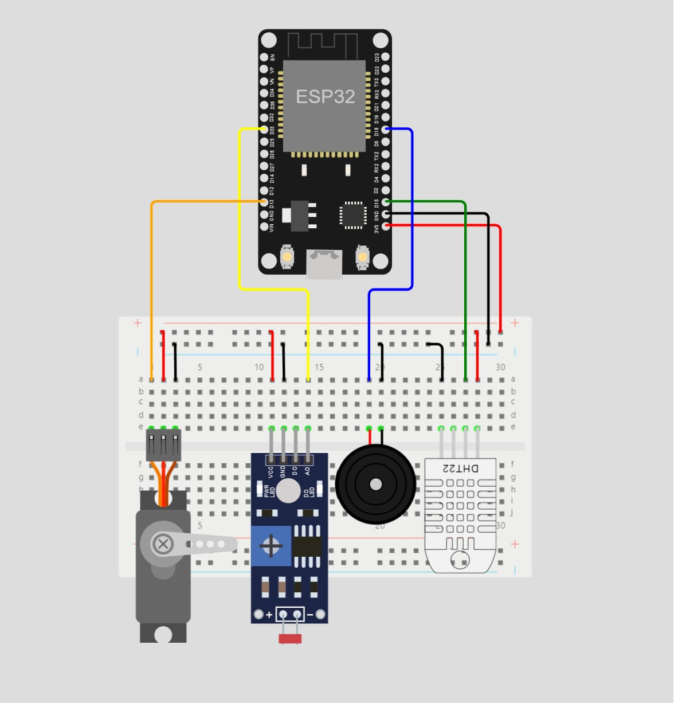

# Smart Medi Box - Enhanced with IoT capabilities

This project builds upon the basic Medibox functionality to create a more advanced device that assists users in managing their medication schedules effectively. 

## Node-RED Dashboard

In addition to the existing features, this enhanced version incorporates the following functionalities:

## New Features

### Light Intensity Monitoring

- To ensure the optimal storage conditions for light-sensitive medicines, a Light Dependent Resistor (LDR) has been integrated.
- Real-time light intensity readings are displayed on a separate group in the Node-RED dashboard, using a gauge for immediate values and a plot for visualizing past variations.
- Intensity values are normalized within the range of 0 to 1, where 0 represents the minimum and 1 represents the maximum intensity.

### Shaded Sliding Window with Servo Motor

- A shaded sliding window is incorporated to regulate the amount of light entering the Medibox.
- A servo motor is responsible for adjusting the window's position. The motor's angle can be adjusted between 0 to 180 degrees based on lighting conditions.
- The relationship between the motor angle and light intensity is defined by the equation: θ = θoffset + (180 − θoffset) × I × γ, where θ is the motor angle, θoffset is the minimum angle, I is the light intensity, and γ is the controlling factor.

### User-Adjustable Parameters

- Users can now customize the minimum angle and controlling factor for the shaded sliding window.
- A new group in the Node-RED dashboard features two slider controls:
  - The first slider ranges from 0 to 120, enabling users to adjust the minimum angle.
  - The second slider ranges from 0 to 1, allowing users to modify the controlling factor.

## Hardware Components

- ESP32 module
- LDR sensor
- Servo motor
- DHT22 sensor
- Buzzer

## Wokwi Simulation

## Flows.json File

For the Node-RED dashboard configuration, please refer to the [flows.json](https://github.com/RovinKYK/Smart-Medi-Box-Version-2/blob/main/flows.json) file.

## Previous Version

To view the previous version of the Medibox project, please visit the [Previous Version](https://github.com/RovinKYK/Smart-Medi-Box).

## Usage

1. [Connect the hardware components as per the updated circuit diagram]
2. [Clone or download the repository]
3. [Upload the code to your ESP32 board]
4. [Set up Node-RED dashboard using the flows.json file]
